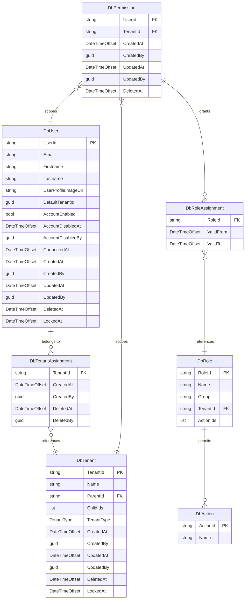
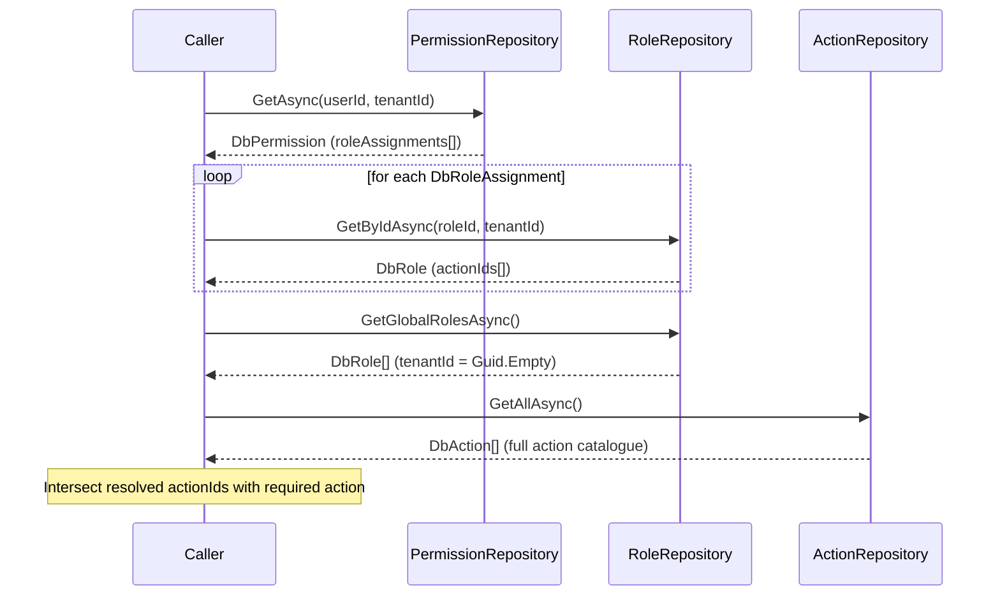
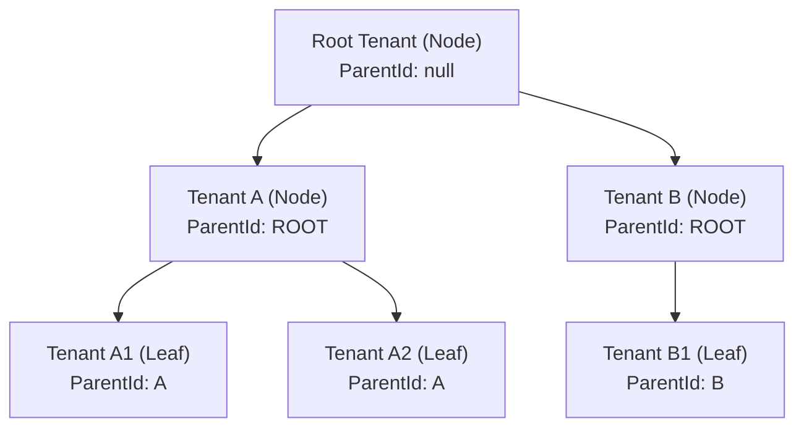
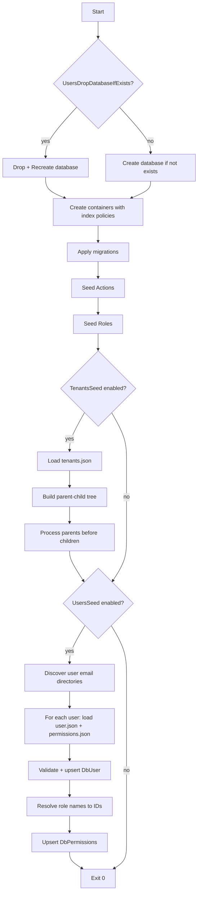

# Users Module

## Overview

The Users module provides multi-tenant identity and access management for the platform. It manages:

- **Users** (`DbUser`) — people with profiles and tenant memberships
- **Tenants** (`DbTenant`) — organizational units arranged in a hierarchy (nodes and leaves)
- **Roles** (`DbRole`) — named permission sets scoped to a tenant or globally
- **Actions** (`DbAction`) — discrete capabilities a role can grant (e.g. `users:read`)
- **Permissions** (`DbPermission`) — the runtime link between a user, a tenant, and their assigned roles

All data lives in **Azure Cosmos DB NoSQL** (database: `users-db`). The module exposes provider-agnostic repository interfaces (
`Users.Infrastructure.Contracts`) with a Cosmos DB implementation (`Users.Infrastructure.CosmosDb`) that can be swapped for any
other persistence technology without touching consumers.

---

## Project Structure

```
src/
  Users.Shared/                        Enums shared across all Users projects
  Users.Infrastructure.Entities/       CosmosDB document records
  Users.Infrastructure.Contracts/      Repository interfaces (provider-agnostic)
  Users.Infrastructure.CosmosDb/       CosmosDB implementation
  Users.InitContainer/                 Console app — DB provisioning + seed
  Users.InitContainer.Data/            Seed data files (JSON, per-email directories)
```

### Dependency Graph

```
Libraries.Shared  ──────────────────────────────────────────────────────┐
  └── Users.Shared                                                       │
        └── Users.Infrastructure.Entities  ──────────────────────────── │
              └── Users.Infrastructure.Contracts                         │
                    └── Users.Infrastructure.CosmosDb ← Microsoft.Azure.Cosmos
                          └── Users.InitContainer ← Users.InitContainer.Data
```

`HttpApi` and `FunctionApp1` reference `Users.Infrastructure.Contracts` + `Users.Infrastructure.CosmosDb` only.

---

## Domain Model

### Entities

| Entity       | Class          | Container     | Partition Key | Doc `id`   | Audit Interfaces                                    |
|--------------|----------------|---------------|---------------|------------|-----------------------------------------------------|
| User profile | `DbUser`       | `users`       | `/id`         | `UserId`   | `ICreatable, IUpdatable, ISoftDeletable, ILockable` |
| Tenant       | `DbTenant`     | `tenants`     | `/id`         | `TenantId` | `ICreatable, IUpdatable, ISoftDeletable, ILockable` |
| Role         | `DbRole`       | `roles`       | `/tenantId`   | `RoleId`   | —                                                   |
| Action       | `DbAction`     | `actions`     | `/id`         | `ActionId` | —                                                   |
| Permission   | `DbPermission` | `permissions` | `/tenantId`   | `UserId`   | `ICreatable, IUpdatable, ISoftDeletable`            |

### Entity Relationship Diagram



---

## RBAC Permission Model

A user's effective permissions for a given tenant are resolved as follows:

```
DbUser.TenantAssignments  →  which tenants the user belongs to
DbPermission (userId + tenantId)  →  which roles the user has in that tenant
DbRole.ActionIds  →  which actions those roles permit
DbAction  →  the named capability being checked
```

Global roles (`DbRole.TenantId = Guid.Empty`) are available across all tenants and are resolved alongside tenant-specific roles.

### Permission Resolution Flow



### Temporal Role Validity

`DbRoleAssignment` carries optional `ValidFrom` / `ValidTo` timestamps. A role assignment is active only when `now` falls within
the validity window:

- `ValidFrom = null` → active from the beginning of time
- `ValidTo = null` → active until the end of time

Callers must filter expired assignments at query time.

---

## Tenant Hierarchy

Tenants form a tree. Each `DbTenant` stores:

- `ParentId` — ID of the parent tenant (`null` or empty GUID for root tenants)
- `ChildIds` — list of direct children IDs
- `TenantType` — `Node` (branch, has children) or `Leaf` (no children)

### Dual-Write Contract

Both `ParentId` and `ChildIds` are maintained. Any operation that creates or breaks a parent-child relationship **must** update
both documents atomically (these are different partition keys, so Cosmos DB cannot guarantee atomicity — compensating logic with
ETag-based optimistic concurrency is used).

`ITenantRepository` exposes `AddChildAsync(parentId, childId)` and `RemoveChildAsync(parentId, childId)` that encapsulate both
writes.

### Hierarchy Example



---

## CosmosDB Container Design

### `users` container

| Property      | Value    |
|---------------|----------|
| Partition key | `/id`    |
| Document `id` | `UserId` |

**Access patterns:**

| Query                                                                                         | Type            | Notes                          |
|-----------------------------------------------------------------------------------------------|-----------------|--------------------------------|
| `ReadItemAsync(userId, userId)`                                                               | Point read      | Primary lookup by user ID      |
| `SELECT * WHERE c.email = @email`                                                             | Cross-partition | Login flow — needs email index |
| `SELECT * WHERE EXISTS (SELECT VALUE t FROM t IN c.tenantAssignments WHERE t.tenantId = @id)` | Cross-partition | List users in a tenant         |

**Index policy:**

```json
{
  "includedPaths": [
    {
      "path": "/*"
    }
  ],
  "excludedPaths": [
    {
      "path": "/userProfileImageUri/?"
    }
  ],
  "compositeIndexes": [
    [
      {
        "path": "/lastname",
        "order": "ascending"
      },
      {
        "path": "/firstname",
        "order": "ascending"
      }
    ]
  ]
}
```

---

### `tenants` container

| Property      | Value      |
|---------------|------------|
| Partition key | `/id`      |
| Document `id` | `TenantId` |

**Access patterns:**

| Query                                   | Type            | Notes                                        |
|-----------------------------------------|-----------------|----------------------------------------------|
| `ReadItemAsync(tenantId, tenantId)`     | Point read      | Lookup by ID                                 |
| `SELECT * WHERE c.parentId = @parentId` | Cross-partition | List children (fallback / consistency check) |
| `SELECT * FROM c`                       | Cross-partition | Full list for admin UI                       |

Index on `/parentId/?` explicitly.

---

### `roles` container

| Property               | Value                   |
|------------------------|-------------------------|
| Partition key          | `/tenantId`             |
| Document `id`          | `RoleId`                |
| Global roles partition | `tenantId = Guid.Empty` |

**Access patterns:**

| Query                                        | Type         | Notes                   |
|----------------------------------------------|--------------|-------------------------|
| `ReadItemAsync(roleId, tenantId)`            | Point read   | Lookup by role + tenant |
| `SELECT * WHERE c.tenantId = @tenantId`      | In-partition | All roles for a tenant  |
| `SELECT * WHERE c.tenantId = '00000000-...'` | In-partition | All global roles        |

---

### `actions` container

| Property      | Value      |
|---------------|------------|
| Partition key | `/id`      |
| Document `id` | `ActionId` |

Small, static reference data. Self-partitioned so every read is a point read. Loaded in full at startup for caching.

---

### `permissions` container

| Property      | Value       |
|---------------|-------------|
| Partition key | `/tenantId` |
| Document `id` | `UserId`    |

One document per user-tenant pair. `id = userId` is unique within a partition (`tenantId`), so the composite key
`(userId, tenantId)` guarantees one permission document per user per tenant.

**Access patterns:**

| Query                             | Type            | Notes                                                        |
|-----------------------------------|-----------------|--------------------------------------------------------------|
| `ReadItemAsync(userId, tenantId)` | Point read      | "What roles does user X have in tenant Y?" — primary pattern |
| `SELECT * WHERE c.id = @userId`   | Cross-partition | All tenant permissions for a user — expensive, use sparingly |

**Index policy:** Include `/roleAssignments/[]/roleId/?` for role-based queries.

---

## Repository Contracts

All interfaces live in `Users.Infrastructure.Contracts`. They are provider-agnostic — no Cosmos DB types leak into this layer.

### Generic Base

```csharp
public interface IRepository<TEntity, in TKey>
{
    Task<TEntity?> GetAsync(TKey id, CancellationToken cancellationToken);
    Task<IReadOnlyList<TEntity>> GetAllAsync(CancellationToken cancellationToken);
    Task<TEntity> AddAsync(TEntity entity, CancellationToken cancellationToken);
    Task<TEntity> UpdateAsync(TEntity entity, CancellationToken cancellationToken);
    Task DeleteAsync(TKey id, Guid deletedBy, CancellationToken cancellationToken);
}
```

### `IUserRepository`

```csharp
public interface IUserRepository : IRepository<DbUser, string>
{
    Task<DbUser?> GetByEmailAsync(string email, CancellationToken ct = default);

    // WARNING: cross-partition fan-out — use for admin/search only
    Task<IReadOnlyList<DbUser>> GetByTenantAsync(string tenantId, CancellationToken ct = default);

    Task PatchAddTenantAssignmentAsync(string userId, DbUser.DbTenantAssignment assignment, Guid updatedBy, CancellationToken ct = default);
    Task PatchRemoveTenantAssignmentAsync(string userId, string tenantId, Guid deletedBy, CancellationToken ct = default);
    Task PatchAccountEnabledAsync(string userId, bool enabled, Guid? disabledBy, CancellationToken ct = default);
    Task PatchConnectedAtAsync(string userId, DateTimeOffset connectedAt, CancellationToken ct = default);
}
```

### `ITenantRepository`

```csharp
public interface ITenantRepository : IRepository<DbTenant, string>
{
    // WARNING: cross-partition fan-out — acceptable for bounded tenant sets
    Task<IReadOnlyList<DbTenant>> GetAllAsync(CancellationToken ct = default);

    Task AddChildAsync(string parentId, string childId, CancellationToken ct = default);
    Task RemoveChildAsync(string parentId, string childId, CancellationToken ct = default);
}
```

### `IRoleRepository`

Composite partition key — does not extend the generic base.

```csharp
public interface IRoleRepository
{
    Task<DbRole?> GetByIdAsync(string roleId, string tenantId, CancellationToken ct = default);
    Task<IReadOnlyList<DbRole>> GetByTenantAsync(string tenantId, CancellationToken ct = default);
    Task<IReadOnlyList<DbRole>> GetGlobalRolesAsync(CancellationToken ct = default);
    Task<DbRole> CreateAsync(DbRole role, CancellationToken ct = default);
    Task<DbRole> UpdateAsync(DbRole role, CancellationToken ct = default);
    Task DeleteAsync(string roleId, string tenantId, CancellationToken ct = default);
}
```

### `IActionRepository`

```csharp
public interface IActionRepository
{
    Task<DbAction?> GetByIdAsync(string actionId, CancellationToken ct = default);
    Task<IReadOnlyList<DbAction>> GetAllAsync(CancellationToken ct = default);
    Task<DbAction> CreateAsync(DbAction action, CancellationToken ct = default);
}
```

### `IPermissionRepository`

Composite partition key — does not extend the generic base.

```csharp
public interface IPermissionRepository
{
    // Primary access pattern
    Task<DbPermission?> GetAsync(string userId, string tenantId, CancellationToken ct = default);

    // WARNING: cross-partition fan-out — cache results where possible
    Task<IReadOnlyList<DbPermission>> GetAllForUserAsync(string userId, CancellationToken ct = default);

    Task<DbPermission> UpsertAsync(DbPermission permission, CancellationToken ct = default);
    Task DeleteAsync(string userId, string tenantId, CancellationToken ct = default);
}
```

---

## CosmosDB Implementation

### Architecture

```
Users.Infrastructure.CosmosDb/
  Configuration/
    ICosmosDbContainerProvider<T>    Typed container handle per entity
    ICosmosDbKeysProvider<T>         Partition key + primary key resolution per entity
    CosmosDbConfigurator             Fluent DI builder
  Options/
    CosmosDbOptions                  Connection, database name, TLS flag
  Repositories/
    SoftDeleteCosmosRepository<T>    Generic base — CRUD, soft delete, batch, patch
    UserRepository
    TenantRepository
    RoleRepository
    ActionRepository
    PermissionRepository
  Extensions/
    ServiceCollectionExtensions      AddUsersCosmosDb(IConfiguration)
```

### `SoftDeleteCosmosRepository<T>` Capabilities

The base class (ported from `Libraries.Shared.CSharp`) provides:

- `AddAsync` / `AddMultipleAsync` — always clears `DeletedAt`/`DeletedBy` before insert
- `UpdateAsync` / `UpdateMultipleAsync`
- `GetAsync(id, partitionKey)` — returns `null` if soft-deleted
- `GetIncludingDeletedAsync(id, partitionKey)` — bypasses soft-delete filter
- `GetAllAsync(filterExpression?)` — optional dynamic LINQ filter via `System.Linq.Dynamic.Core`
- `GetMultipleAsync(ids)` — batch read via `ReadManyItemsAsync`
- `ExistsAsync(ids)` — bulk existence check, excludes soft-deleted
- `DeleteAsync(id, partitionKey, deletedBy)` — soft delete
- `DeleteMultipleAsync(entities, deletedBy)` — batch soft delete via `TransactionalBatch`
- `ExecuteQueryAsync<T>` — protected query helper with iterator pagination
- `ExecuteQueryWithParametersAsync` — auto-appends `(NOT IS_DEFINED(c.deletedAt) OR IS_NULL(c.deletedAt))`

All queries automatically exclude soft-deleted documents unless using the `IncludingDeleted` variants.

### Options Record

```csharp
public sealed record CosmosDbOptions
{
    public const string ConfigSectionName = "Users:CosmosDb";

    [Required] public required string AccountEndpoint { get; init; }
    [Required] public required string DatabaseName    { get; init; }

    public string? ConnectionString              { get; init; }  // overrides for local emulator
    public bool    IgnoreSslCertificateValidation { get; init; } // local emulator TLS bypass
}
```

### DI Registration

```csharp
// In Program.cs or DiCompositor.cs
services.AddOptionsAndValidateOnStart<CosmosDbOptions>(configuration, CosmosDbOptions.ConfigSectionName);
services.AddUsersCosmosDb(configuration);

// After app.Build() — creates DB + containers before first request
await app.UseUsersCosmosDbAsync();
```

`AddUsersCosmosDb` registers a `CosmosClient` singleton (Managed Identity in Azure, connection string for local emulator) and one
`ICosmosDbContainerProvider<T>` + `ICosmosDbKeysProvider<T>` per entity.

### Serialization

All entities use `[JsonProperty]` from Newtonsoft.Json. The `CosmosClient` must be configured with a Newtonsoft serializer:

```csharp
new CosmosClientOptions { Serializer = new CosmosNewtonsoftSerializer() }
```

### Authentication

- **Azure**: `DefaultAzureCredential` (resolves to the user-assigned Managed Identity)
- **Local**: `ConnectionString` in `CosmosDbOptions` (emulator well-known key)

---

## Provider Independence

The `Contracts` layer contains only C# interfaces — zero Cosmos DB SDK references. Swapping the persistence backend requires:

```
                  ┌──────────────────────────────┐
                  │  Users.Infrastructure        │
                  │      .Contracts              │
                  │  IUserRepository             │
                  │  ITenantRepository  ...      │
                  └──────────────┬───────────────┘
                                 │ implements
             ┌───────────────────┼────────────────────────┐
             ▼                                             ▼
┌────────────────────────┐              ┌──────────────────────────────┐
│ Users.Infrastructure   │              │ Users.Infrastructure         │
│ .CosmosDb              │              │ .EntityFramework  (future)   │
│ UserRepository         │              │ EfUserRepository             │
│ TenantRepository  ...  │              │ EfTenantRepository  ...      │
└────────────────────────┘              └──────────────────────────────┘
             │  only one active at a time
             ▼
  HttpApi / FunctionApp1
  Program.cs / DiCompositor.cs
  ─────────────────────────────
  services.AddUsersCosmosDb(cfg);   ← swap this one line
  await app.UseUsersCosmosDbAsync();           ← and this one
```

**To switch to Entity Framework:**

1. Create `Users.Infrastructure.EntityFramework` referencing `Contracts` + `Entities`
2. Implement every interface (`EfUserRepository : IUserRepository`, etc.)
3. Add `AddUsersEntityFramework(IConfiguration)` extension
4. In consuming projects: replace `AddUsersCosmosDb` → `AddUsersEntityFramework` and remove the Cosmos project reference

No other changes needed.

---

## InitContainer

`Users.InitContainer` is a .NET 8 console app that provisions the CosmosDB database and seeds initial data. It runs as a *
*Container Apps Job** (Manual trigger) in Azure and as a Docker Compose service locally.

### Initialization Sequence



### Seed Data Layout

Files live in `Users.InitContainer.Data/SeedData/` and are copied to the output directory (
`CopyToOutputDirectory: PreserveNewest`). The runtime path is injected via `SeederOptions.SeedDataFilePath`.

```
{SeedDataFilePath}/
  users-db/
    actions.json              global action definitions
    roles.json                system roles (TenantId = Guid.Empty for global roles)
    tenants.json              flat array — seeder builds tree, processes parent-first
    users/
      admin@example.com/
        user.json             DbUser document
        permissions.json      REQUIRED — array of DbPermission, one per tenant
      user2@example.com/
        user.json
        permissions.json
```

**Rules:**

- `permissions.json` is required for every user directory — missing file throws at seed time
- Role assignments accept `roleId` (direct GUID) or `roleName` (seeder resolves to ID)
- Seeding is idempotent — upsert semantics, safe to run multiple times

### SeederOptions

```csharp
public sealed record SeederOptions
{
    public const string ConfigSectionName = "SeederOptions";

    [Required] public required bool   TenantsSeed     { get; init; }
    [Required] public required bool   UsersSeed        { get; init; }
    [Required] public required string SeedDataFilePath { get; init; }
}
```

---

## Migration Mechanism

Schema and data migrations run exactly once per environment. Applied versions are recorded in the `migrations` CosmosDB container so re-runs skip them.

### Container

| Property      | Value        |
|---------------|--------------|
| Container     | `migrations` |
| Partition key | `/id`        |
| Document `id` | `Id` (GUID)  |

No soft-delete — migrations are permanent records.

### Interfaces (internal to `Users.Infrastructure.CosmosDb`)

```csharp
internal interface IMigration
{
    string Version { get; }   // sort key and uniqueness key — format: YYYYMMDD_HHMMSS_Description
    Task UpAsync(IServiceProvider serviceProvider, CancellationToken cancellationToken);
}

internal interface IMigrationService
{
    Task ApplyMigrationsAsync(CancellationToken cancellationToken);
}
```

`UpAsync` receives `IServiceProvider` so each migration can resolve the repositories it needs.

### `MigrationService` behaviour

`MigrationService` is instantiated with `IEnumerable<IMigration>` resolved from DI. On each startup:

1. Loads all applied versions from the `migrations` container
2. Finds pending migrations (`Version` not in applied set)
3. Sorts pending by `Version` ascending (lexicographic — the YYYYMMDD_HHMMSS prefix guarantees chronological order)
4. Applies each, then writes a `DbMigration` record to commit it

### Public entry point

`IMigrationService` is internal. Consumers call the public extension method:

```csharp
// In Users.InitContainer/Program.cs
await app.ApplyUsersMigrationsAsync(CancellationToken.None);
```

### Version naming convention

```
V{YYYYMMDD}_{HHMMSS}_{Description}
```

Example: `V20250501_000000_InitialSeed`

Always use the **UTC timestamp** of when the migration was created. The `V` prefix and underscores are required for lexicographic sort correctness.

### First migration: `V20250501_000000_InitialSeed`

Seeds the minimum bootstrap data that every new deployment needs:

| Type   | Details |
|--------|---------|
| Root tenant | `TenantId = 10000000-0000-0000-0000-000000000001`, `Name = "Root"`, `TenantType = Node`, `ParentId = Guid.Empty` |
| 16 actions | All action IDs from `UserManagementActions` — `Tenants.View`, `Module.Users`, `Users.View`, … |
| Super Admin role | `RoleId = a50fcd0f-e253-41eb-98b3-ef02bbde476e`, `Name = "Super Admin"`, `TenantId = Guid.Empty` (global), all 16 action IDs |

All three are idempotent: existing documents are skipped.

### Adding a new migration

1. Create `src/Users.Infrastructure.CosmosDb.Migrations/V{YYYYMMDD}_{HHMMSS}_{Description}.cs`
2. Implement `IMigration` (public sealed class)
3. Register in `Users.Infrastructure.CosmosDb.Migrations/DependencyInjection.cs`:
   ```csharp
   services.AddSingleton<IMigration, V20250601_120000_AddSomething>();
   ```
4. The `Users.InitContainer` calls `.AddUsersCosmosDbMigrations()` in its composition root — all registered `IMigration` implementations are discovered and executed in version order on startup.

---

## Local Development

### Docker Compose

Add `docker-compose.cosmosdb.yaml` alongside the existing compose files:

```yaml
services:
  cosmosdb-emulator:
    image: mcr.microsoft.com/cosmosdb/linux/azure-cosmos-emulator:vnext-EN20251223
    environment:
      - AZURE_COSMOS_EMULATOR_PARTITION_COUNT=3
      - AZURE_COSMOS_EMULATOR_ENABLE_DATA_PERSISTENCE=true
    ports:
      - "8081:8081"
    volumes:
      - ${VOLUMES_PATH}/cosmosdb/data:/tmp/cosmos/appdata
    healthcheck:
      test: [ "CMD", "curl", "-f", "-k", "https://localhost:8081/_explorer/emulator.pem" ]
      interval: 10s
      retries: 30
      start_period: 60s
    networks:
      - azure_container_apps_net

  users-init-container:
    image: ${USERS_INIT_CONTAINER_IMAGE}
    depends_on:
      cosmosdb-emulator:
        condition: service_healthy
    environment:
      - Users__CosmosDb__ConnectionString=${COSMOSDB_CONNECTION_STRING}
      - Users__CosmosDb__DatabaseName=${USERS_COSMOSDB_DATABASE}
      - Users__CosmosDb__IgnoreSslCertificateValidation=true
      - SeederOptions__TenantsSeed=true
      - SeederOptions__UsersSeed=true
      - SeederOptions__SeedDataFilePath=/app/seed-data/users-db
    volumes:
      - ${SEED_DATA_PATH}:/app/seed-data
    networks:
      - azure_container_apps_net
```

### `.env.dev` Additions

```env
USERS_INIT_CONTAINER_IMAGE=users-init-container:1.0.0
COSMOSDB_CONNECTION_STRING=AccountEndpoint=https://cosmosdb-emulator:8081/;AccountKey=C2y6yDjf5/R+ob0N8A7Cgv30VRDJIWEHLM+4QDU5DE2nQ9nDuVTqobD34b9n=;
USERS_COSMOSDB_DATABASE=users-db
SEED_DATA_PATH=./src/Users/Users.InitContainer.Data/SeedData
```

### Start Command

```bash
docker compose \
  -f docker-compose.yaml \
  -f docker-compose.observability.yaml \
  -f docker-compose.cosmosdb.yaml \
  --env-file .env.dev \
  -p my-container-apps up --build --remove-orphans
```

The emulator explorer is available at `https://localhost:8081/_explorer/index.html` once healthy.

---

## Azure Deployment (Bicep)

Three new Bicep modules are required:

| Module                                                          | Resource created                                 |
|-----------------------------------------------------------------|--------------------------------------------------|
| `infrastructure/modules/cosmosdb.bicep`                         | CosmosDB account + `users-db` database           |
| `infrastructure/modules/helpers/cosmosdb-role-assignment.bicep` | Data Contributor role for user-assigned identity |
| `infrastructure/modules/helpers/init-container-job.bicep`       | Container Apps Job (Manual trigger)              |

The CosmosDB account uses **Serverless** capacity for `dev`/`tst` and **Autoscale provisioned** for `prd`. Session consistency is
the default.

Wiring in `main.bicep`:

```bicep
module cosmosDb './modules/cosmosdb.bicep' = { ... dependsOn: [applicationResourceGroup] }
module cosmosDbRoleAssignment './modules/helpers/cosmosdb-role-assignment.bicep' = { ... dependsOn: [cosmosDb, userAssignIdentity] }
module usersInitContainerJob './modules/helpers/init-container-job.bicep' = { ... dependsOn: [cosmosDb, cosmosDbRoleAssignment, applicationContainerAppsEnvironment] }
```

---

## DiCompositor Pattern

Consuming projects use a `DiCompositor.cs` (static extension class) to keep `Program.cs` minimal:

```csharp
// HttpApi/DiCompositor.cs
public static class DiCompositor
{
    public static void ConfigureInstrumentation(this WebApplicationBuilder builder)
    {
        builder.Services.AddSingleton<HttpApiInstrumentation>();
    }

    public static void ConfigureServices(this IServiceCollection services, IConfiguration configuration)
    {
        services.AddOptionsAndValidateOnStart<CosmosDbOptions>(
            configuration, CosmosDbOptions.ConfigSectionName);
        services.AddUsersCosmosDb(configuration);
    }
}

// HttpApi/Program.cs
builder.ConfigureInstrumentation();
builder.Services.ConfigureServices(builder.Configuration);
// ...
var app = builder.Build();
await app.UseUsersCosmosDbAsync();   // creates DB + containers before first request
```

`AddOptionsAndValidateOnStart<T>` from `Libraries.Shared` uses `.ValidateDataAnnotations().ValidateOnStart()` — missing required
configuration fields fail the app immediately at startup with a descriptive error rather than at first use.

---

## Claude Code Skills

Four slash commands in `.claude/commands/` assist with development:

| Command                       | Purpose                                                        |
|-------------------------------|----------------------------------------------------------------|
| `/scaffold-cosmos-repository` | Generate `{Entity}Repository.cs` from template and wire DI     |
| `/run-users-init-container`   | Run init container locally against the Docker Compose emulator |
| `/add-seed-data`              | Add a new user or tenant to the seed data files interactively  |
| `/check-cosmos-container`     | Query local emulator and display item counts per container     |

---

## Verification Checklist

- [ ] `dotnet build` passes with 0 warnings for all 5 Users projects
- [ ] `docker compose -f docker-compose.yaml -f docker-compose.cosmosdb.yaml --env-file .env.dev up` starts emulator healthy
- [ ] `users-init-container` service exits with code 0
- [ ] Emulator explorer at `https://localhost:8081/_explorer/index.html` shows `users-db` with 5 containers and seed data
- [ ] `az deployment sub what-if` shows three new Azure resources without errors
- [ ] Consuming project (`HttpApi`) compiles with `AddUsersCosmosDb` in `DiCompositor.cs`
